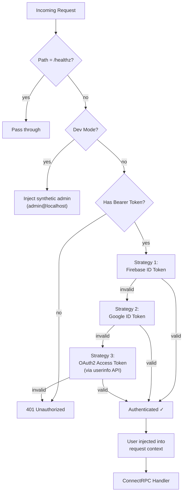

# 🔐 Security & Authentication

Candela uses a **multi-strategy authentication** system designed to securely serve three distinct client types: browser users, developer CLI tools, and service accounts. This document covers the authentication architecture, authorization model, and security considerations.

## Authentication Architecture



### Strategy Waterfall

The middleware (`pkg/auth/firebase.go`) tries three strategies in sequence. The first successful validation wins:

| # | Strategy | Client | Token Source | Validation Method |
|---|----------|--------|-------------|-------------------|
| 1 | **Firebase ID Token** | Browser UI | Firebase JS SDK (`onAuthStateChanged`) | `fbAuth.VerifyIDToken()` |
| 2 | **Google ID Token** | Service accounts, `candela` with `idtoken` | `idtoken.NewTokenSource(audience)` | `idtoken.Validate(token, audience)` |
| 3 | **OAuth2 Access Token** | `candela` with user ADC | `candela auth login` (or `gcloud auth application-default login`) | `googleapis.com/oauth2/v3/userinfo` |

> [!NOTE]
> Strategy 3 makes an HTTP call to Google's userinfo endpoint on every request. This adds ~50ms latency but is the only way to validate user-scoped Application Default Credentials (ADC) that `candela` uses when `candela auth login` (or `gcloud auth application-default login`) provides an access token rather than an ID token.

### Auth Bypass

These paths skip authentication entirely:
- `/healthz` — health check endpoint (Cloud Run readiness probe)

---

## Authorization — Role-Based Access Control (RBAC)

### Roles

| Role | Enum | Description |
|------|------|-------------|
| `developer` | `USER_ROLE_DEVELOPER = 1` | Use proxy, view own traces/costs, self-service RPCs |
| `admin` | `USER_ROLE_ADMIN = 2` | Full access: manage users, budgets, view all data |

### Admin Guard Interceptor

The `AdminInterceptor` (`pkg/auth/admin.go`) is a ConnectRPC unary interceptor that enforces admin-only access:

```
Request → Auth Middleware → Admin Interceptor → Handler
                               │
                               ├── Self-service RPC? → Pass through
                               └── Admin RPC? → Look up user role
                                                   ├── admin → Pass through
                                                   └── !admin → 403 PermissionDenied
```

### RPC Access Matrix

#### Self-Service RPCs (any authenticated user)
| RPC | Description |
|-----|-------------|
| `GetCurrentUser` | Returns the caller's own profile, budget, and active grants |
| `GetMyBudget` | Returns the caller's budget and current-period spending |

#### Admin-Only RPCs (13 RPCs)
| Category | RPCs |
|----------|------|
| **Users** | `CreateUser`, `ListUsers`, `GetUser`, `UpdateUser`, `DeactivateUser`, `ReactivateUser` |
| **Budgets** | `SetBudget`, `GetBudget`, `ResetSpend` |
| **Grants** | `CreateGrant`, `ListGrants`, `RevokeGrant` |
| **Audit** | `ListAuditLog` |

#### Unguarded Services (Data-Level Scoping)
| Service | Scoping Method |
|---------|----------------|
| `TraceService` | `scopeUserID()` injects user filter into storage queries; `GetTrace` uses post-fetch auth gate |
| `DashboardService` | `scopeUserID()` injects user filter into usage/model queries |
| `IngestionService` | Write-only — validated by project API key, not user identity |
| `ProjectService` | Currently unguarded (future: project-level RBAC) |

---

## Data Isolation — Per-User Trace Scoping

Non-admin developers can only see their own traces and spans. This is enforced at two levels:

### Query-Based Endpoints (ListTraces, SearchSpans, Dashboard)

The `scopeUserID()` helper (`pkg/connecthandlers/scope.go`) determines the caller's identity:
- **Admin** → returns `""` (empty string = no filter, sees all data)
- **Developer** → returns sanitized email (e.g., `alice@example.com`)

This value is injected into `TraceQuery.UserID`, `SpanQuery.UserID`, or `UsageQuery.UserID`. All storage backends (BigQuery, DuckDB, SQLite) apply the filter in SQL:

```sql
AND (? = '' OR user_id = ?)
```

### GetTrace (Direct Access by Trace ID)

`GetTrace` cannot pre-filter because it queries by `trace_id`, not user. Instead, it uses a **post-fetch authorization gate**:

1. Fetch the full trace from storage
2. Extract the trace owner via `traceUserID()` — checks root span first, then falls back to any span with `user_id`
3. Compare against `scopeUserID(ctx)`
4. If mismatch → `PermissionDenied`
5. If no `user_id` on any span (legacy data) → allow access, log for backfill visibility

### Error Sanitization

All handlers use `internalError()` (`pkg/connecthandlers/errors.go`) for storage failures. This logs the real error server-side via `slog.Error` and returns a generic `"internal error"` to clients, preventing leakage of SQL errors, file paths, or infrastructure details.

---

## User Identity & Context Propagation

### User Struct

```go
// pkg/auth/context.go
type User struct {
    ID    string // Firebase UID or Google subject (`sub` claim)
    Email string // Verified email claim (lowercased)
}
```

### Context Flow

The authenticated user is attached to the request context and available throughout the handler stack:

```go
// In any handler:
user := auth.FromContext(ctx)        // *auth.User or nil
userID := auth.IDFromContext(ctx)    // string (empty if no user)
email := auth.EmailFromContext(ctx)  // string (empty if no user)
```

The proxy uses context-propagated user identity for:
- **Per-user span attribution** — `span.UserID = caller.ID`
- **Budget deduction** — `users.DeductSpend(ctx, span.UserID, cost, tokens)`
- **User-scoped trace queries** — developers only see their own traces

---

## Dev Mode

When `CANDELA_DEV_MODE=true` or `auth.dev_mode: true` in config:

- **No token validation** — all requests succeed
- **Synthetic admin user** injected: `{ID: "dev-admin", Email: "admin@localhost"}`
- All admin RPCs are accessible
- All traces are visible (no user scoping)

> [!WARNING]
> Never run dev mode in production. There is no authentication bypass — all requests get full admin access.

---

## `candela` Authentication

### Solo Mode
No authentication needed. All requests to `:1234` and `:8181` are unauthenticated.

### Solo + Cloud Mode
Uses **Application Default Credentials (ADC)** to call Vertex AI directly:
```bash
candela auth login                      # native OAuth2 (recommended)
# Or: gcloud auth application-default login
```
No server-side auth needed — ADC tokens are used for upstream cloud calls only.

### Team Mode
`candela` injects OIDC tokens into requests to the Candela Cloud Run server:

```
IDE → candela (:1234)
         │
         ├── Local model → Ollama (no auth)
         │
         └── Cloud model → Candela Server (Cloud Run)
                              │
              ┌───────────────┘
              │ Authorization: Bearer <google-id-token>
              ▼
         Auth Middleware (Strategy 2 or 3)
```

Token acquisition flow:
1. `candela` reads `~/.config/candela/config.yaml` for `remote` and `audience`
2. Uses `google.DefaultTokenSource()` to get an ADC token
3. Injects `Authorization: Bearer <token>` on every proxied request

---

## IAP Authentication (Legacy)

The `IAPMiddleware` (`pkg/auth/iap.go`) validates Cloud IAP JWT assertions from the `x-goog-iap-jwt-assertion` header. This is the **original** auth path when Candela ran behind Cloud IAP.

The current production setup uses `FirebaseAuthMiddleware` instead, which provides more flexible multi-strategy auth. The IAP middleware remains available for deployments behind Cloud IAP.

---

## Input Validation

All `UserService` requests are validated server-side using [`protovalidate`](https://github.com/bufbuild/protovalidate). The validation interceptor runs **before** the admin guard:

```
Request → protovalidate → AdminInterceptor → Handler
```

See [docs/user-management.md](user-management.md) for the full validation rule reference.

---

## Security Hardening Checklist

| Item | Status | Notes |
|------|--------|-------|
| Token validation on all non-health endpoints | ✅ | 3-strategy waterfall |
| Email claim normalization (lowercase) | ✅ | Prevents case-based identity bypass |
| Admin role enforcement via ConnectRPC interceptor | ✅ | Per-RPC ACL |
| Per-user trace/span data isolation | ✅ | `scopeUserID()` + `traceUserID()` auth gate |
| Internal error message sanitization | ✅ | `internalError()` logs server-side, returns generic message |
| Rate limiting per user | ✅ | `CheckRateLimit()` in `UserStore` |
| Budget enforcement before proxy calls | ✅ | `CheckBudget()` pre-flight |
| Secrets not baked into container images | ✅ | `entrypoint.sh` generates config from env vars |
| ADC token auto-refresh | ✅ | `oauth2.TokenSource` handles refresh |
| API key hashing (bcrypt) | ✅ | `APIKey.KeyHash` never exposed |
| Proxy does not store upstream API keys | ✅ | Forwarded transparently |
| CORS origin allowlist | ✅ | Configurable, defaults to localhost |
| Firebase authorized domains | ⚠️ | Must be configured in Firebase Console |
| HTTPS in production | ⚠️ | Handled by Cloud Run / load balancer |
| Audit logging for admin actions | ✅ | Firestore `audit_log` collection |

---

## Implementation Files

| File | Purpose |
|------|---------|
| `pkg/auth/context.go` | `User` struct, context get/set helpers |
| `pkg/auth/firebase.go` | `FirebaseAuthMiddleware` — 3-strategy waterfall |
| `pkg/auth/iap.go` | `IAPMiddleware` — Cloud IAP JWT validation (legacy) |
| `pkg/auth/admin.go` | `AdminInterceptor` — ConnectRPC admin guard |
| `pkg/connecthandlers/scope.go` | `scopeUserID()` — per-user data scoping helper |
| `pkg/connecthandlers/errors.go` | `internalError()` — sanitized error responses |
| `cmd/candela-server/main.go` | Middleware wiring, Firebase init, dev mode |
| `cmd/candela/main.go` | ADC token injection for Team Mode |

---

## 🐝 eBPF Enforcement & Transparent Proxy

> [!NOTE]
> The transparent proxy with SNI-based routing is production-ready (phases 0–4 shipped).

Candela provides kernel-level enforcement to guarantee that **all LLM API traffic flows through the proxy** — making observability and budget controls impossible to bypass, even by misconfigured or malicious workloads.

### Architecture

```
┌─────────────────────────────────────────────────────────────┐
│  Pod                                                        │
│                                                             │
│  ┌─────────────┐        iptables redirect        ┌───────┐ │
│  │ Application │ ──── port 443 ─────────────────→ │Candela│ │
│  │ (any SDK)   │                                  │Sidecar│ │
│  └─────────────┘                                  │:15001 │ │
│                                                   └───┬───┘ │
└───────────────────────────────────────────────────────┼─────┘
                                                        │
        ┌───────────────────────────────────────────────┘
        ▼
   Upstream LLM APIs (OpenAI, Anthropic, Gemini)
```

### Enforcement Layers

| Layer | Technology | Purpose |
|-------|-----------|---------|
| **Network** | Cilium `FQDNNetworkPolicy` | Block direct egress to LLM provider hostnames |
| **Kernel** | Tetragon `TracingPolicy` (eBPF kprobes) | Detect/kill unauthorized binaries connecting to port 443 |
| **Redirect** | `iptables` init container | Transparently redirect outbound TLS to sidecar |
| **TLS** | Ephemeral CA + SNI-based routing | MITM termination for request-level observability; per-provider opt-out |

### Single Source of Truth

All enforcement resources are generated from `candela-policy.yaml` — the same file
the sidecar reads for provider routing. Providers are defined **once**; Helm templates
derive FQDNNetworkPolicy, TracingPolicy, and iptables rules automatically.

```yaml
# candela-policy.yaml (excerpt)
providers:
  - name: openai
    upstream: https://api.openai.com
    intercept: true

enforcement:
  enabled: true
  mode: transparent        # transparent | explicit
  tetragon:
    enabled: true
    mode: audit            # audit (Post) | enforce (Sigkill)
```

### Phased Rollout

| Phase | Milestone | Status |
|-------|-----------|--------|
| 0 | Config schema design (`candela-policy.yaml`) | ✅ Shipped |
| 1 | Extend `Provider` struct with host/intercept fields | ✅ Shipped |
| 2 | Config file loading in `candela-sidecar` | ✅ Shipped |
| 3 | Helm chart with enforcement templates | ✅ Shipped |
| 4 | Transparent listener (Go — SNI routing) | ✅ Shipped |
| 5 | TLS MITM termination (Rust — `rustls` + `rcgen`) | ✅ Shipped |
| 6 | Tetragon + Hubble observability integration | 📋 Planned |

---

## 🔒 MITM TLS Termination (Phase 5)

For intercepted (SNI-matched) LLM connections, the transparent listener performs
full TLS termination using an ephemeral per-pod CA. This enables request-level
observability (model, tokens, cost) without any SDK changes.

### Architecture

```
┌───────────────┐  TLS (ephemeral cert)  ┌───────────┐  plaintext (bidir copy)  ┌────────┐  TLS (real cert)  ┌──────────┐
│  Application  │ ───────────────────→  │Transparent│ ───────────────────────→ │ Candela│ ───────────────→ │ Upstream │
│  (any SDK)    │                      │  Listener │                          │  Proxy │                    │  LLM API │
└───────────────┘                      │  :15001  │                          │  :8080 │                    └──────────┘
                                       └───────────┘                          └────────┘
```

### Ephemeral CA

The `EphemeralCA` (implemented in `candela-transparent::ca`) generates a self-signed
CA certificate at pod startup. For each intercepted SNI hostname, it dynamically
generates a leaf certificate with:

- `subjectAltName: DNS:<sni>` matching the original upstream
- Short validity (24h) since it's ephemeral
- ALPN: `["h2", "http/1.1"]` for protocol transparency
- Certificates are cached per-hostname to avoid regeneration

### Trust Injection

The application pod must trust the ephemeral CA certificate. This follows the
same pattern used by Istio/Envoy sidecars:

1. Init container writes CA PEM to a shared volume (e.g., `/var/run/candela/ca.pem`)
2. Application pod mounts the volume and sets `SSL_CERT_FILE` / `REQUESTS_CA_BUNDLE`
3. The Helm chart mounts the CA cert volume automatically

### Provider MITM Opt-Out

Providers with certificate pinning can disable MITM via `mitm: false`:

```yaml
providers:
  - name: pinned-service
    upstream: https://internal.pinned.example.com
    intercept: true
    mitm: false   # connections are intercepted for stats but tunneled without TLS termination
```

When `mitm: false`, the connection is counted as `intercepted` but tunneled
directly to the original destination (Phase 4 passthrough behavior).

### Protocol Transparency

The MITM layer is strictly L4-transparent. After TLS termination, decrypted bytes
flow via `copy_bidirectional` to the proxy as plaintext TCP. The client’s chosen
protocol (HTTP/1.1 or HTTP/2, negotiated via ALPN) passes through unchanged —
the proxy’s `hyper` server auto-detects both.

### Stats

The transparent listener exposes counters at `/stats`:

```json
{"intercepted": 10, "mitm": 8, "passthrough": 2, "errors": 0}
```

| Counter | Description |
|---------|-------------|
| `intercepted` | Connections whose SNI matched a provider |
| `mitm` | Connections that completed MITM TLS termination |
| `passthrough` | Connections tunneled without interception |
| `errors` | Failed connections (handshake failures, timeouts) |

